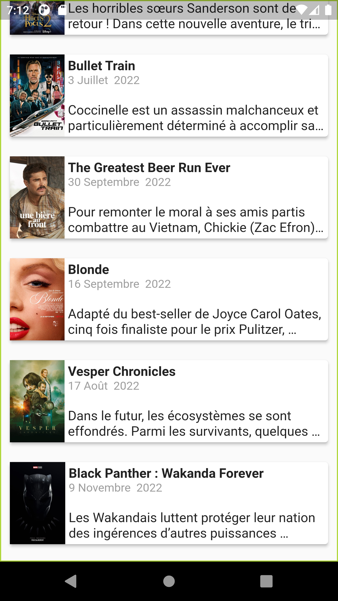
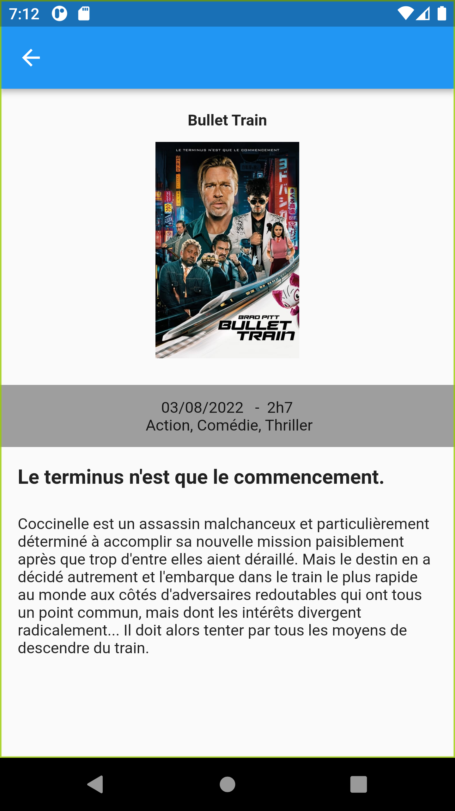

# movie_app

A new Flutter project.

## Getting Started

This project is a starting point for a Flutter application.

A few resources to get you started if this is your first Flutter project:

- [Lab: Write your first Flutter app](https://docs.flutter.dev/get-started/codelab)
- [Cookbook: Useful Flutter samples](https://docs.flutter.dev/cookbook)

For help getting started with Flutter development, view the
[online documentation](https://docs.flutter.dev/), which offers tutorials,
samples, guidance on mobile development, and a full API reference.
# movie

#Home page
This page, displays the 10 trending movies, resulted from the TMDB Api, in a listView, with few related information

#Description page
This page displays the movie data in more details, the overview of the app can be visible and readable (By scrolling in cas the text doesnt fit the screen) and more infos are visible,
In the appBar, the icon will help us to return back to the main page

